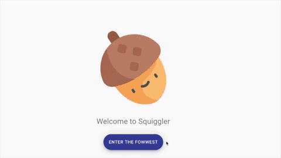

# Squiggler
#### Social Media for Squirrels




Visit it @
https://quizzical-bartik-dfb084.netlify.com/


My first react project, made for a weekend project in my second month of coding at Makers Academy. Back end taken from https://github.com/makersacademy/chitter_api_backend

## Frameworks and Libraries Used
- React
- React router
- Axios
- Material UI

## User stories implemented
- Creating Users
- Logging in
- Posting "squiggles" (tweets)
- Viewing all squiggles
- Deleting Squiggles
- Liking Squiggles
- Unliking Squiggles

## Run it yourself
#### Prequisites
- Node

#### MacOS
In terminal:
```sh
$ git clone https://github.com/zi-codes/squiggler.git
$ cd squiggler
$ npm install
$ npm start
```
In browser, visit:
```sh
http://localhost:3000/
```
